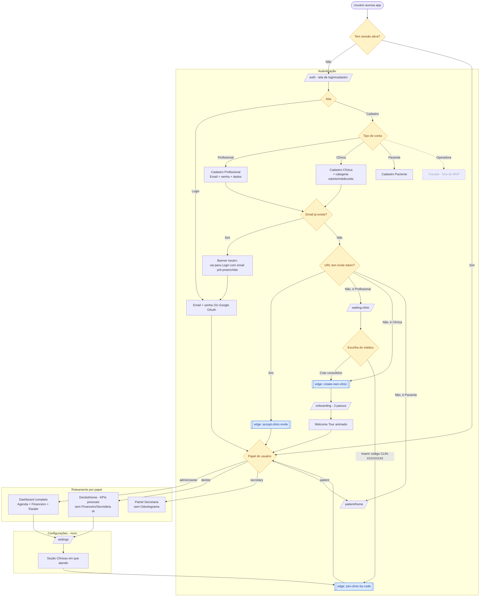

# Fluxo real da plataforma IACLIN

Diagrama gerado a partir do código vigente em `src/pages/Auth.tsx`, `src/contexts/AuthContext.tsx`, `src/pages/WaitingClinic.tsx`, `src/pages/Onboarding.tsx` e edge functions em `supabase/functions/*`.

## Legenda das edge functions

| Nó no diagrama | Arquivo | O que faz |
|---|---|---|
| `accept-clinic-invite` | `supabase/functions/accept-clinic-invite/index.ts` | Vincula usuário recém-cadastrado à clínica via token na URL `?invite=...` |
| `create-own-clinic` | `supabase/functions/create-own-clinic/index.ts` | Cria consultório próprio (idempotente). Usado por médico solo e por cadastro de clínica. Promove a `admin` + `owner`. |
| `join-clinic-by-code` | `supabase/functions/join-clinic-by-code/index.ts` | Valida código `CLIN-XXXXXXXX` (regex `/^CLIN-[A-Z2-9]{8}$/`) e cria membership. Reutilizado em `WaitingClinic` e em `Configurações → Clínicas em que atendo`. |
| `validate-clinic-code` | `supabase/functions/validate-clinic-code/index.ts` | Pré-validação opcional do código antes de submeter. |
| `create-clinic-invite` | `supabase/functions/create-clinic-invite/index.ts` | Gera token de convite por e-mail (fluxo do dono da clínica enviando link ao médico). |

## Diferenças vs. o draw.io original

1. **Operadora travada**: o caminho "Planos de Convênio" do diagrama corresponde ao papel `operator`, atualmente desativado no MVP (memória core).
2. **Fluxo de invite por URL**: o draw.io não tinha o ramo `?invite=TOKEN → accept-clinic-invite`, que é o caminho **primário** quando a clínica convida o médico.
3. **Decisão pós-cadastro do profissional**: a tela `/waiting-clinic` oferece **dois** caminhos (criar consultório próprio OU inserir código), não apenas um.
4. **Google OAuth**: presente no código tanto em login quanto cadastro — não estava no draw.io.
5. **Conflito de e-mail duplicado**: o tratamento atual é banner neutro com auto-redirect para Login, e não erro destrutivo.
6. **Roteamento por papel**: dentist tem home própria (`DentistHome`); secretary não vê odontograma; patient vai para `/patient/*`.
7. **Configurações**: a seção "Clínicas em que atendo" reaproveita `join-clinic-by-code` para o médico entrar em clínicas adicionais sem passar pelo `WaitingClinic`.
